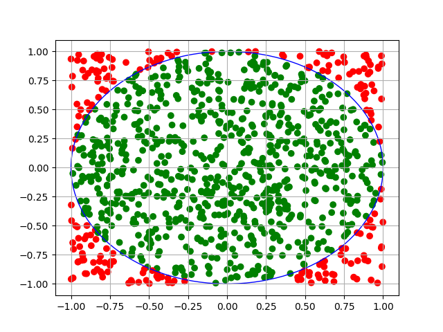

# Monte Carlo Marbles Simulation

I generated 1000 uniformly random points on a graph within a square of [-1, 1] on the x and y axes

These points represent marbles, the circle represents a bowl, and the square represents anywhere the marble can land

I drew a circle (in blue) with a radius of 1 centered around (0, 0)

The points that lie inside the circle are green and the ones outside the circle but inside the square are red

I took the ratio of the number of points inside the circle and the total number of points (inside the square) and compared it to the ratio of the areas between the circle and the square

We find that:

$\frac{\text{the number of marbles inside the circle}}{\text{the number of marbles inside the entire square}} \approx \frac{\text{the area of the circle}}{\text{the area of the square}}$

$\frac{\text{the number of marbles inside the circle (green)}}{\text{the number of marbles inside the entire square (green + red)}} = \frac{786}{1000} = 0.786$

$\frac{\text{the area of the circle}}{\text{the area of the square}} = \frac{\pi}{4} \approx 0.785$